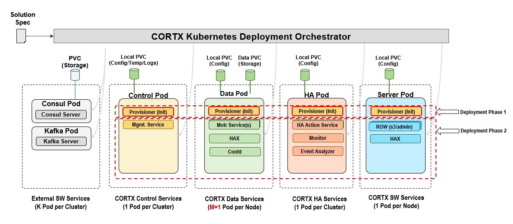

# CORTX on Kubernetes

[](https://app.codacy.com/gh/Seagate/cortx-k8s?utm_source=github.com&utm_medium=referral&utm_content=Seagate/cortx-k8s&utm_campaign=Badge_Grade_Settings)

[CORTX Community Object Storage](http://cortx.io/) is 100% open-source object storage, uniquely optimized for mass capacity storage devices. This repository provides capability and support for deploying CORTX onto the [Kubernetes](https://kubernetes.io/) container orchestration platform.

## Table of Contents

1.  [Project Overview](#project-overview)
2.  [Reference Architecture](#reference-architecture)
3.  [CORTX on Kubernetes Prerequisites](#cortx-on-kubernetes-prerequisites)
4.  [Kubernetes Reference Deployments](#kubernetes-reference-deployments)
5.  [Quick Starts](#quick-starts)
    1.  [Using the prereq deploy script (Optional)](#using-the-prereq-deploy-script-optional)
    2.  [Deploying CORTX on Kubernetes](#deploying-cortx-on-kubernetes)
    3.  [Upgrading CORTX on Kubernetes](#upgrading-cortx-on-kubernetes)
    4.  [Using CORTX on Kubernetes](#using-cortx-on-kubernetes)
    5.  [Log collection for CORTX on Kubernetes](#log-collection-for-cortx-on-kubernetes)
    6.  [Undeploying CORTX on Kubernetes](#undeploying-cortx-on-kubernetes)
6.  [Solution YAML Overview](#solution-yaml-overview)
7.  [Troubleshooting](#troubleshooting)
8.  [License](#license)

## Project Overview

This repository provides application-specific [Helm](https://helm.sh) charts and deployment scripts for deploying CORTX on to an existing [Kubernetes](https://kubernetes.io) cluster.

Deploying and managing Kubernetes is outside the scope of this repository, however configuration and best practices are offered as guidance where appropriate, along with links to [reference Kubernetes cluster deployment processes](#kubernetes-reference-deployments).

## Reference Architecture



CORTX on Kubernetes consists of five primary components:
1.  Prerequisite services, consisting of [Consul](https://github.com/hashicorp/consul), [Apache Kafka](https://kafka.apache.org/), and [OpenLDAP](https://www.openldap.org/).

2.  CORTX Control Pods
    -  These pods maintain the CORTX control plane
    -  Usually with a cardinality of one pod per CORTX deployment

3.  CORTX Data Pods
    -  These pods maintain the CORTX data plane
    -  Usually with a cardinality of one pod per CORTX node

4.  CORTX Server Pods
    -  These pods maintain the CORTX API and user interfaces
    -  Usually with a cardinality of one pod per CORTX node (but scalable based on system traffic)

5.  CORTX HA Pods
    -  These pods maintain the overall high-availability of the CORTX deployment
    -  Usually with a cardinality of one pod per CORTX deployment

## CORTX on Kubernetes Prerequisites

1.  **[Helm](https://helm.sh/)**

    CORTX on Kubernetes is provided via Helm Charts. As such, you will need Helm installed locally to deploy CORTX on Kubernetes. You can find the specific installation instructions for your local platform via the [Installing Helm](https://helm.sh/docs/intro/install/) section of the official Helm documentation.

2.  **Uniform device paths**

    CORTX on Kubernetes currently expects all Kubernetes Nodes to have a uniform device/drive setup across the Kubernetes cluster. This is to say that CORTX on Kubernetes expects all Kubernetes Nodes to have the same `/dev/sdb`, `/dev/sdc`, `/dev/sdN`, etc device paths on every node.

    :information_source: _This requirement will be going away in a future release (some time after v0.0.20)_.

3.  **Required kernel parameters**

    CORTX on Kubernetes currently requires the `vm.max_map_count` set to a specific minimum level of `30000000` (thirty million) on the Kubernetes Nodes which `cortx-data` Pods will run.
    - The `prereq-deploy-cortx-cloud.sh` script will set this value prior to deployment if you choose to utilize it.
    - The `cortx-data` Pods include an initContainer that will check for this minimal value and halt deployment if not met. 

4.  **Local path provisioner**

    CORTX on Kubernetes currently uses the [Rancher Local Provisioner](https://github.com/rancher/local-path-provisioner) to manage some dynamic provisioning of local storage for prerequisite services.
    - The `prereq-deploy-cortx-cloud.sh` script will ensure this directory exists, if you choose to utilize it.
    - This directory prefix is configurable in the `solution.yaml` file via the `solution.common.storage_provisioner_path`, while appending `local-path-provisioner` to it.
       - You can manually create this path via the default values of `/mnt/fs-local-volume/local-path-provisioner` on every Kubernetes Node
       - Or you can customize the value of `solution.common.storage_provisioner_path` and create directories on every Kubernetes Node to match (i.e. `/mnt/cortx-k8s/local-volumes/local-path-provisioner`.

5.  **OpenLDAP directories**

    CORTX on Kubernetes currently leverages OpenLDAP as a required service. The deployment scripts require specific local directories to exist on the Kubernetes Nodes which OpenLDAP will run on.
    - The `prereq-deploy-cortx-cloud.sh` script will ensure these directories exist, if you choose to utilize it.
    - Or you can manually create the following directories on every Kubernetes Node to ensure functional operation of OpenLDAP:
        1.  `/etc/3rd-party/openldap`
        2.  `/var/data/3rd-party`
        3.  `/var/log/3rd-party`

    :information_source: _This requirement will be going away in a future release (some time after v0.0.20)_.

## Kubernetes Reference Deployments

There are numerous ways to install and configure a complete Kubernetes cluster. As long as the prerequisites in the previous step are all satisfied, CORTX on Kubernetes should deploy successfully.

For reference material, we have provided existing Kubernetes deployment models that have been verified to work with CORTX on Kubernetes. These are only provided for reference and are not meant to be explicit deployment constraints.

1.  [Seagate Internal Jenkins Job](http://eos-jenkins.mero.colo.seagate.com/job/Cortx-kubernetes/job/setup-kubernetes-cluster/)
2.  [CORTX on AWS and Kubernetes - Quick Install Guide](doc/cortx-aws-k8s-installation.md)
3.  [CORTX on Minikube - Quick Install Guide](doc/cortx-minikube-k8s-installation.md)

Should you have trouble deploying CORTX on Kubernetes to your Kubernetes cluster, please open an [Issue](https://github.com/Seagate/cortx-k8s/issues) in this repository for further troubleshooting.

## Quick Starts

All steps in the following quick starts assume the proper prerequisites have been installed or configured as described in [CORTX on Kubernetes Prerequisites](#cortx-on-kubernetes-prerequisites) above.

### Using the prereq deploy script (Optional)

If you have direct access to the underlying Kubernetes Nodes in your cluster, CORTX on Kubernetes provides a [prerequisite deployment script](https://github.com/Seagate/cortx-k8s/blob/main/k8_cortx_cloud/prereq-deploy-cortx-cloud.sh) that will configure the majority of the low-level system configuration requirements prior to CORTX deployment. This is not a required step if you choose to ensure all the [prerequisites](#cortx-on-kubernetes-prerequisites) mentioned above are satisfied manually.

   1.  Copy `prereq-deploy-cortx-cloud.sh` script, and the solution yaml file to all worker nodes:

   ```bash
   scp prereq-deploy-cortx-cloud.sh <user>@<worker-node-IP-address>:<path-to-prereq-script>
   scp <solution_yaml_file> <user>@<worker-node-IP-address>:<path-to-solution-yaml>
   ```

   2.  Run prerequisite script on all worker nodes in the cluster, and any untainted control nodes which allow Pod scheduling. `<disk>` is a required input to run this script. This disk should NOT be any of the devices listed in `solution.storage.cvg*` in the `solution.yaml` file:

   ```bash
   sudo ./prereq-deploy-cortx-cloud.sh <disk> [<solution-file>]
   ```

   :information_source: `<solution-file>` is an optional input to run `prereq-deploy-cortx-cloud.sh` script. Make sure to use the same solution file for prereqs, deploy and destroy scripts. The default `<solution-file>` is `solution.yaml`.

### Deploying CORTX on Kubernetes

1.  Clone this repository to a machine with connectivity to your Kubernetes cluster:

   ```bash
   git clone https://github.com/Seagate/cortx-k8s
   ```

>  :information_source: You can also use the latest released version of the CORTX on Kubernetes code via the **Releases** page found at https://github.com/Seagate/cortx-k8s/releases/latest

2.  Update or clone `./k8_cortx_cloud/solution.yaml` to reflect your environment. The most common and expected updates are reflected below:
    - Update all passwords in solution.yaml. The `csm-secret` should include one special character in cortx-secret.
    - Update the images section with cortx-all image tag desired to be used. 
        - Each specific release of the CORTX on Kubernetes code will point to a specific predefined container image.
        - This can be overriden as desired.
    - Update SNS and DIX durability values. The default value for both parameters is `1+0+0`.
    - Update storage cvg devices for data and metadata with respect to the devices in your environment.
    - Update nodes section with proper node hostnames from your Kubernetes cluster.
        - If the Kubernetes control plane nodes are required to be used for deployment, make sure to remove the taint from it before deploying CORTX.
        - For further details and reference, you can view the official Kubernetes documentation topic on [Taints & Tolerations](https://kubernetes.io/docs/concepts/scheduling-eviction/taint-and-toleration/)
    - For further details on `solution.yaml` specifics, review the [Solution YAML Overview](#solution-yaml-overview) below.

3.  Run the `deploy-cortx-cloud.sh` script, passing in the path to your updated `solution.yaml` file.

   ```bash
   ./deploy-cortx-cloud.sh solution.yaml
   ```

4.  Validate CORTX on Kubernetes status

   ```bash
   DATA_POD=$(kubectl get pods -l cortx.io/service-type=cortx-data --no-headers | awk '{print $1}' | head -n 1)
   kubectl exec -it $DATA_POD -c cortx-hax -- /bin/bash -c "hctl status"
   ```

### Upgrading CORTX on Kubernetes

>  :information_source: As the CORTX on Kubernetes architecture is evolving, the upgrade path for CORTX on Kubernetes is evolving as well. As a workaround until more foundational upgrade capabilities exist, the following steps are available to manually upgrade your CORTX on Kubernetes environment to a more recent release.

1.  Deploy CORTX on Kubernetes according to the [Deploying CORTX on Kubernetes](#deploying-cortx-on-kubernetes) steps above.

2.  Run the upgrade script to patch the CORTX on Kubernetes Deployments using an updated image _(:information_source: You will want to update the `TARGET_IMAGE` variable below to your desired image tag)_. The script will stop all CORTX Pods, update the Deployments, and then re-start the Pods.

   ```bash
   TARGET_IMAGE="ghcr.io/seagate/cortx-all:2.0.0-641-custom-ci"
   ./upgrade-cortx-cloud.sh -s solution.yaml -i $TARGET_IMAGE
   ```

### Using CORTX on Kubernetes

**_TODO_** Port https://seagate-systems.atlassian.net/wiki/spaces/PUB/pages/754155622/CORTX+Kubernetes+N-Pod+Deployment+and+Upgrade+Document+using+Services+Framework#5.-Understanding-Management-and-S3-Endpoints-and-configuring-External-Load-balancer-service(Optional) here or into a linked `doc/readme` file.

### Log collection for CORTX on Kubernetes

To gather logs from a CORTX on Kubernetes deployment, run the `logs-cortx-cloud.sh` script while passing in the `solution.yaml` file to it.

```bash
./logs-cortx-cloud.sh --solution-config solution.yaml
```

### Undeploying CORTX on Kubernetes

Run the `destroy-cortx-cloud.sh` script, passing in the path to the previously updated `solution.yaml` file

```bash
./destroy-cortx-cloud.sh solution.yaml
```

## Solution YAML Overview

The CORTX solution consists of all paramaters required to deploy CORTX on Kubernetes. The pre-req, deploy, and destroy scripts parse the solution file and extract information they need to deploy and destroy CORTX.

All paths below are prefixed with `solution.` for fully-qualified naming.
### Global parameters

| Name                     | Description                                                                             | Value           |
| ------------------------ | --------------------------------------------------------------------------------------- | --------------- |
| `namespace`              | The kubernetes namespace for CORTX Pods to be deployed in.                              | `default`            |

### Secret parameters

This section contains the CORTX and third-party authentication information used to deploy CORTX on Kubernetes.

| Name                     | Description                                                                             | Value           |
| ------------------------ | --------------------------------------------------------------------------------------- | --------------- |
| `secrets.name`           | Name for the Kubernetes secret CORTX uses to store solution-specific secrets.           | `cortx-secret`            |
| `secrets.content.openldap_admin_secret`          | Administrator password for the OpenLDAP required service (deprecated) | `seagate1` |
| `secrets.content.kafka_admin_secret`          | Administrator password for the Kafka required service        | `Seagate@123` |
| `secrets.content.consul_admin_secret`          | Administrator password for the Consul required service        | `Seagate@123` |
| `secrets.content.common_admin_secret`          | Administrator password for the CORTX common services        | `Seagate@123` |
| `secrets.content.s3_auth_admin_secret`          | Administrator password for the S3 Auth CORTX component        | `ldapadmin` |
| `secrets.content.csm_auth_admin_secret`          | Administrator password for the CSM Auth CORTX component        | `seagate2` |
| `secrets.content.csm_mgmt_admin_secret`          | Administrator password for the CSM Managment CORTX component   | `Cortxadmin@123` |

### Image parameters

This section contains the CORTX and third-party images used to deploy CORTX on Kubernetes.

| Name                     | Description                                                                             | Value           |
| ------------------------ | --------------------------------------------------------------------------------------- | --------------- |
| `images.cortxcontrol`    | Image registry, repository, & tag for the CORTX Control components   | `ghcr.io/seagate/cortx-all:2.0.0-{VERSION}` |
| `images.cortxdata`       | Image registry, repository, & tag for the CORTX Data components      | `ghcr.io/seagate/cortx-all:2.0.0-{VERSION}` |
| `images.cortxserver`     | Image registry, repository, & tag for the CORTX Server components    | `ghcr.io/seagate/cortx-all:2.0.0-{VERSION}` |
| `images.cortxha`         | Image registry, repository, & tag for the CORTX HA components        | `ghcr.io/seagate/cortx-all:2.0.0-{VERSION}` |
| `images.cortxclient`     | Image registry, repository, & tag for the CORTX Client components    | `ghcr.io/seagate/cortx-all:2.0.0-{VERSION}` |
| `images.openldap`        | Image registry, repository, & tag for the OpenLDAP required service  | `ghcr.io/seagate/symas-openldap:2.4.58` |
| `images.consul`          | Image registry, repository, & tag for the Consul required service    | `ghcr.io/seagate/consul:1.10.0` |
| `images.kafka`           | Image registry, repository, & tag for the Kafka required service     | `ghcr.io/seagate/kafka:3.0.0-debian-10-r7` |
| `images.zookeeper`       | Image registry, repository, & tag for the Zookeeper required service | `ghcr.io/seagate/zookeeper:3.7.0-debian-10-r182` |
| `images.rancher`         | Image registry, repository, & tag for the Rancher Local Path Provisioner container   | `ghcr.io/seagate/local-path-provisioner:v0.0.20` |
| `images.busybox`         | Image registry, repository, & tag for the utility busybox container   | `ghcr.io/seagate/busybox:latest` |

### Common parameters

This section contains common paramaters that applies to all CORTX Data nodes.

| Name                     | Description                                                                             | Value           |
| ------------------------ | --------------------------------------------------------------------------------------- | --------------- |
| `_TODO_`                          | TODO       | `TODO` |
| `common.storage_provisioner_path` | TODO       | `/mnt/fs-local-volume` |
| `common.container_path.local`     | TODO      | `/etc/cortx` |
| `common.container_path.shared`    | TODO      | `/share` |
| `common.container_path.log`       | TOD       | `/etc/cortx/log` |
| `common.s3.default_iam_users.auth_admin`      | TBD | `sgiamadmin` |
| `common.s3.default_iam_users.auth_user`       | TBD | `user_name` |
| `common.s3.num_inst`              | TODO       | `2` |
| `common.s3.start_port_num`        | TODO      | `28051` |
| `common.s3.max_start_timeout`     | TODO      | `240` |
| `common.motr.num_client_inst`     | TODO      | `0` |
| `common.motr.start_port_num`      | TODO       | `29000` |
| `common.hax.procotol` | Protocol that is used to communicate with HAX components running across Server and Data Pods. | `https` | 
| `common.hax.service_name` | Service name that is used to communicate with HAX components running across Server and Data Pods. | `cortx-hax-svc` |
| `common.hax.port_num` | Port number that is used to communicate with HAX components running across Server and Data Pods. | `22003` |

### Storage parameters

The metadata and data drives are defined in this section. All drives must be the same across all nodes on which CORTX Data will be deployed. A minimum of 1 CVG of type `ios` with one metadata drive and one data drive is required.

| Name                     | Description                                                                             | Value           |
| ------------------------ | --------------------------------------------------------------------------------------- | --------------- |
| `_TODO_`       | TBD | `TBD` |

### Node parameters

This section contains information about all the worker nodes used to deploy CORTX cloud cluster. All nodes must have all the metadata and data drives mentioned in the "Storage" section above.

| Name                     | Description                                                                             | Value           |
| ------------------------ | --------------------------------------------------------------------------------------- | --------------- |
| `nodes.node1.name`       | Kubernetes node name for the first node in the Kubernetes cluster available to deploy CORTX components. | `node-1` |
| `nodes.node2.name`       | Kubernetes node name for the second node in the Kubernetes cluster available to deploy CORTX components. | `node-2` |
| `...`                    | ...                                                                                     | `...`
| `nodes.nodeN.name`       | Kubernetes node name for the Nth node in the Kubernetes cluster available to deploy CORTX components. | `""` |

## Troubleshooting

### Using stub containers

The Helm charts work with both "stub" and "CORTX ALL" containers, allowing users to deploy both placeholder Kubernetes artifacts and functioning CORTX deployments using the same code base. If you are encountering issues deploying CORTX on Kubernetes, you can utilize the stub container method by setting the necessary component in `solution.yaml` to use an image of `ghcr.io/seagate/centos:7` instead of a CORTX-based image. This will deploy the same Kubernetes structure, expect the container entrypoints will be set to `sleep 3650d` to allow for deployment progression and user inspection of the overall deployment.

## License

CORTX is 100% Open Source. Most of the project is licensed under the [Apache 2.0 License](LICENSE) and the rest is under AGPLv3; check the specific License file of each CORTX submodule to determine which is which.
