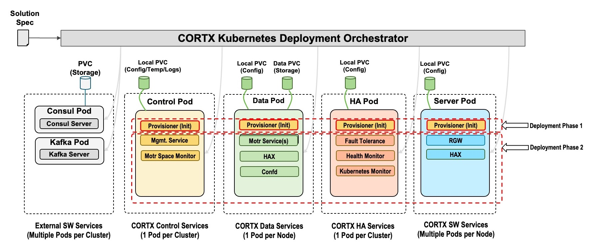

# CORTX on Kubernetes

[](https://app.codacy.com/gh/Seagate/cortx-k8s?utm_source=github.com&utm_medium=referral&utm_content=Seagate/cortx-k8s&utm_campaign=Badge_Grade_Settings)

[CORTX Community Object Storage](https://github.com/Seagate/cortx) is 100% open-source object storage, uniquely optimized for mass capacity storage devices. This repository provides capability and support for deploying CORTX onto the [Kubernetes](https://kubernetes.io/) container orchestration platform.

## Table of Contents

1. [Project Overview](#project-overview)
2. [Reference Architecture](#reference-architecture)
3. [CORTX on Kubernetes Prerequisites](#cortx-on-kubernetes-prerequisites)
4. [Kubernetes Reference Deployments](#kubernetes-reference-deployments)
5. [Getting Started](#getting-started)
    1. [Using the prereq deploy script (Optional)](#using-the-prereq-deploy-script-optional)
    2. [Deploying CORTX on Kubernetes](#deploying-cortx-on-kubernetes)
    3. [Upgrading CORTX on Kubernetes](#upgrading-cortx-on-kubernetes)
    4. [Using CORTX on Kubernetes](#using-cortx-on-kubernetes)
    5. [Log collection for CORTX on Kubernetes](#log-collection-for-cortx-on-kubernetes)
    6. [Undeploying CORTX on Kubernetes](#undeploying-cortx-on-kubernetes)
6. [Solution YAML Overview](#solution-yaml-overview)
7. [Troubleshooting](#troubleshooting)
8. [Glossary](#glossary)
9. [License](#license)

## Project Overview

This repository provides application-specific [Helm](https://helm.sh) charts and deployment scripts for deploying CORTX on to an existing [Kubernetes](https://kubernetes.io) cluster.

Deploying and managing Kubernetes is outside the scope of this repository, however configuration and best practices are offered as guidance where appropriate, along with links to [reference Kubernetes cluster deployment processes](#kubernetes-reference-deployments).

## Reference Architecture



CORTX on Kubernetes consists of five primary components:

1. Prerequisite services, consisting of [Consul](https://github.com/hashicorp/consul) and [Apache Kafka](https://kafka.apache.org/).

2. CORTX Control Pods
    - These pods maintain the CORTX control plane
    - There is a default cardinality of one pod per CORTX deployment

3. CORTX Data Pods
    - These pods maintain the CORTX data plane
    - There is a default cardinality of one pod per defined CVG per CORTX node

4. CORTX Server Pods
    - These pods maintain the CORTX API and user interfaces
    - There is a default cardinality of three pods per CORTX node (but scalable based on system traffic)

5. CORTX HA Pods
    - These pods maintain the overall high-availability of the CORTX deployment
    - There is a default cardinality of one pod per CORTX deployment

## CORTX on Kubernetes Prerequisites

For additional discussion on infrastructure prerequisites in support of other Kubernetes capabilities prior to installing CORTX, please reference the [Prerequisite use cases for deploying CORTX on Kubernetes](doc/prereq-deploy-use-cases.md) guide.

### Required software

#### [Helm](https://helm.sh/)

CORTX on Kubernetes is provided via Helm Charts. As such, you will need Helm installed locally to deploy CORTX on Kubernetes. You can find the specific installation instructions for your local platform via the [Installing Helm](https://helm.sh/docs/intro/install/) section of the official Helm documentation.

#### [yq](https://mikefarah.gitbook.io/yq/)

yq is a command-line YAML processor and must be [installed](https://github.com/mikefarah/yq/#install) for use by the deployment scripts. Version 4.25.1 or later is required.

### Node configuration

#### Uniform device paths

All Kubernetes Nodes must have a uniform device/drive setup across the Kubernetes cluster, i.e. all nodes will have the same `/dev/sdb`, `/dev/sdc`, `/dev/sdN`, etc. device paths.

#### Persistent disk naming and node reboot support

For configuration options in support of persistent device naming and stability across Kubernetes Node reboot support, reference the [Persistent disk naming and node reboot support](/doc/prereq-deploy-use-cases.md#persistent-disk-naming-and-node-reboot-support) section of the [Prerequisite use cases for deploying CORTX on Kubernetes](doc/prereq-deploy-use-cases.md) guide.

#### Kernel parameters

Kernel parameter `vm.max_map_count` must be set to a specific minimum level of `30000000` (thirty million) on the Kubernetes Nodes where `cortx-data` Pods will run.

- The `prereq-deploy-cortx-cloud.sh` script will set this value prior to deployment if you choose to utilize it.
- The `cortx-data` Pods include an initContainer that will check for this minimal value and halt deployment if not met.

### Storage Provisioning

[Rancher Local Path Provisioner](https://github.com/rancher/local-path-provisioner) is used to manage dynamic provisioning of local storage for prerequisite services.

- The `prereq-deploy-cortx-cloud.sh` script will ensure this directory exists, if you choose to utilize it.
- This directory prefix is configurable in the `solution.yaml` file via the `solution.common.storage_provisioner_path`, while appending `local-path-provisioner` to it.
  - You can manually create this path via the default values of `/mnt/fs-local-volume/local-path-provisioner` on every Kubernetes Node
  - Or you can customize the value of `solution.common.storage_provisioner_path` and create directories on every Kubernetes Node to match (i.e. `/mnt/cortx-k8s/local-volumes/local-path-provisioner`.

## Kubernetes Reference Deployments

There are numerous ways to install and configure a complete Kubernetes cluster. As long as the prerequisites in the previous step are all satisfied, CORTX on Kubernetes should deploy successfully.

For reference material, we have provided existing Kubernetes deployment models that have been verified to work with CORTX on Kubernetes. These are only provided for reference and are not meant to be explicit deployment constraints.

1. [Seagate Internal Jenkins Job](http://eos-jenkins.mero.colo.seagate.com/job/Cortx-kubernetes/job/setup-kubernetes-cluster/)
2. [CORTX on AWS and Kubernetes - Quick Start Guide](doc/cortx-aws-k8s-installation.md)
3. [CORTX on minikube - Quick Start Guide](doc/cortx-minikube-k8s-installation.md)

Should you have trouble deploying CORTX on Kubernetes to your Kubernetes cluster, please open an [Issue](https://github.com/Seagate/cortx-k8s/issues) in this repository for further troubleshooting.

## Getting Started

All steps in this section assume the proper prerequisites have been installed or configured as described in [CORTX on Kubernetes Prerequisites](#cortx-on-kubernetes-prerequisites) above.

### Using the prereq deploy script (Optional)

If you have direct access to the underlying Kubernetes Nodes in your cluster, CORTX on Kubernetes provides a [prerequisite deployment script](k8_cortx_cloud/prereq-deploy-cortx-cloud.sh) that will configure the majority of the low-level system configuration requirements prior to CORTX deployment. This is not a required step if you choose to ensure all the [prerequisites](#cortx-on-kubernetes-prerequisites) mentioned above are satisfied manually.

   1. Copy `prereq-deploy-cortx-cloud.sh` script, and the solution yaml file to all worker nodes:

      ```bash
      scp prereq-deploy-cortx-cloud.sh <user>@<worker-node-IP-address>:<path-to-prereq-script>
      scp <solution_yaml_file> <user>@<worker-node-IP-address>:<path-to-solution-yaml>
      ```

   2. Run prerequisite script on all worker nodes in the cluster, and any untainted control nodes which allow Pod scheduling. `<disk>` is a required input to run this script. This disk should NOT be any of the devices listed in `solution.storage.cvg*` in the `solution.yaml` file:

      ```bash
      sudo ./prereq-deploy-cortx-cloud.sh -d <disk> [ -s <solution-file> ]
      ```

      - The `-d <disk>` flag is a required flag to pass the path of the disk or device to mount for secondary storage to the `prereq-deploy-cortx-cloud.sh` script. This should be in the format of `/dev/sdb` etc.

      - The `-s <solution-file>` flag is an optional flag to the `prereq-deploy-cortx-cloud.sh` script. Make sure to use the same solution file for prereqs, deploy and destroy scripts. The default `<solution-file>` is `solution.yaml` if the `-s` flag is not supplied.

### Deploying CORTX on Kubernetes

1. Clone this repository to a machine with connectivity to your Kubernetes cluster:

   ```bash
   git clone https://github.com/Seagate/cortx-k8s
   ```

   >  :information_source: You can also use the latest released version of the CORTX on Kubernetes code via the [**Latest Releases**](https://github.com/Seagate/cortx-k8s/releases/latest) page

2. For initial deployments, copy the example solution configuration file [`./k8_cortx_cloud/solution.example.yaml`](k8_cortx_cloud/solution.example.yaml) to `./k8_cortx_cloud/solution.yaml` or to a filename of your choice.

3. Update the solution configuration file to reflect your environment. The most common and expected updates are reflected below:

   - Update the namespace you want to deploy CORTX into.  The default is "cortx".  If the namespace does not exist then it will be created for you. **There is currently a limitation on the maximum length of the namespace to 20 characters.**

   - Update the `deployment_type` with the desired deployment mode. See under [Global Parameters](#global-parameters) for more details.

   - Update all passwords. The `csm-secret` should include one special character in cortx-secret.

   - Update the images section with cortx-data, cortx-rgw, cortx-control image tags desired to be used.
     - Each specific release of the CORTX on Kubernetes code will point to a specific predefined container image.
     - This can be overridden as desired.

   - Update SNS and DIX durability values. The default value for both parameters is `1+0+0`.

   - Update storage cvg devices for data and metadata with respect to the devices in your environment.

   - Update nodes section with proper node hostnames from your Kubernetes cluster.
     - If the Kubernetes control plane nodes are required to be used for deployment, make sure to remove the taint from it before deploying CORTX.
     - For further details and reference, you can view the official Kubernetes documentation topic on [Taints & Tolerations](https://kubernetes.io/docs/concepts/scheduling-eviction/taint-and-toleration/)

   - For further details on the solution configuration file specifics, review the [Solution YAML Overview](#solution-yaml-overview) section below.

4. Run the `deploy-cortx-cloud.sh` script, passing in the path to your updated `solution.yaml` file.

   ```bash
   ./deploy-cortx-cloud.sh solution.yaml
   ```

5. Validate CORTX on Kubernetes status

   ```bash
   DATA_POD=$(kubectl get pods -l cortx.io/service-type=cortx-data --no-headers | awk '{print $1}' | head -n 1)
   kubectl exec -it $DATA_POD -c cortx-hax -- /bin/bash -c "hctl status"
   ```

### Upgrading CORTX on Kubernetes

> :information_source: As the CORTX on Kubernetes architecture is evolving, the upgrade path for CORTX on Kubernetes is evolving as well. As a workaround until more foundational upgrade capabilities exist, the following steps are available to manually upgrade your CORTX on Kubernetes environment to a more recent release.

This upgrade process updates all containers in all CORTX pods to the new specified image.

To upgrade a previously deployed CORTX cluster, run the `upgrade-cortx-cloud.sh` script to patch the CORTX on Kubernetes deployments using an updated image _(:information_source: You will want to update the `TARGET_IMAGE` variable below to your desired image tag)_. The script will stop all CORTX Pods, update the Deployments and StatefulSets, and then re-start the Pods.

   ```bash
   TARGET_IMAGE="ghcr.io/seagate/cortx-data:2.0.0-835"
   ./upgrade-cortx-cloud.sh -s solution.yaml -i $TARGET_IMAGE
   ```

Note: There are three separate CORTX images (cortx-data, cortx-rgw, and cortx-control).  By specifying any one of these images, all images will be updated to that same version.  For example, if the image `ghcr.io/seagate/cortx-data:2.0.0-835` is specified, then:

- `ghcr.io/seagate/cortx-data:2.0.0-835` will be applied to the cortx-data and cortx-client containers
- `ghcr.io/seagate/cortx-rgw:2.0.0-835` will be applied to the cortx-server containers
- `ghcr.io/seagate/cortx-control:2.0.0-835` will be applied to the cortx-control and cortx-ha containers

To update the image for a specific CORTX Deployment or StatefulSet use `kubectl set image`:

```bash
# Update image on all containers in a cortx-data statefulset
kubectl set image --namespace=${NAMESPACE} statefulset cortx-data '*=ghcr.io/seagate/cortx-data:2.0.0-835'

# Update image on all containers in a cortx-server statefulset
kubectl set image --namespace=${NAMESPACE} statefulset cortx-server '*=ghcr.io/seagate/cortx-rgw:2.0.0-835'

# Update image on all containers in a cortx-control deployment
kubectl set image --namespace=${NAMESPACE} deployment cortx-control '*=ghcr.io/seagate/cortx-control:2.0.0-835'

# Update image on all containers in a cortx-ha deployment
kubectl set image --namespace=${NAMESPACE} deployment cortx-ha '*=ghcr.io/seagate/cortx-control:2.0.0-835'

# Update image on all containers in a cortx-client statefulset
kubectl set image --namespace=${NAMESPACE} statefulset cortx-client '*=ghcr.io/seagate/cortx-client:2.0.0-835'
```

### Using CORTX on Kubernetes

**_TODO_** Port [this Confluence Page](https://seagate-systems.atlassian.net/wiki/spaces/PUB/pages/754155622/CORTX+Kubernetes+N-Pod+Deployment+and+Upgrade+Document+using+Services+Framework#5.-Understanding-Management-and-S3-Endpoints-and-configuring-External-Load-balancer-service(Optional)) here or into a linked `doc/readme` file.

### Log collection for CORTX on Kubernetes

To gather logs from a CORTX on Kubernetes deployment, run the `logs-cortx-cloud.sh` script while passing in the `solution.yaml` file to it.

```bash
./logs-cortx-cloud.sh --solution-config solution.yaml
```

### Undeploying CORTX on Kubernetes

Run the `destroy-cortx-cloud.sh` script, passing in the path to the previously updated `solution.yaml` file

```bash
./destroy-cortx-cloud.sh solution.yaml
```

Note: This script does not uninstall the local provisioner.  If you need to uninstall the local provisioner

```bash
kubectl delete -f ./cortx-cloud-3rd-party-pkg/auto-gen-rancher-provisioner/local-path-storage.yaml
```

## Solution YAML Overview

The CORTX solution configuration file consists of all parameters required to deploy CORTX on Kubernetes. The pre-req, deploy, and destroy scripts parse the solution configuration file and extract information they need to deploy and destroy CORTX.

An example solution configuration is provided by [`solution.example.yaml`](k8_cortx_cloud/solution.example.yaml).

All paths below are prefixed with `solution.` for fully-qualified naming and are required to have a value unless explicitly marked as _(Optional)_ below.

### Global parameters

| Name              | Description                                                                                                                  | Default Value |
| ----------------- | ---------------------------------------------------------------------------------------------------------------------------- | ------------- |
| `namespace`       | The Kubernetes namespace that all CORTX-related resources will be deployed into. Currently limited to a maximum of 20 characters.
| `deployment_type` | The type of deployment. This determines which Kubernetes resources are created. Valid values are `standard` and `data-only`. | `standard`    |

### Secret parameters

This section contains the CORTX and third-party authentication information used to deploy CORTX on Kubernetes.

A Kubernetes Secret is used to hold the various passwords and secret keys needed by the various components.

- If the `secrets.name` field is specified, then CORTX will create and populate this Secret object, using this specified name.  For any `secrets.content` fields that are not specified or do not have a value specified, CORTX will generate a random password.
- If the `secrets.external_secret` field is specified, then CORTX will expect a Kubernetes Secret object to already exist with the specified name, which contains the passwords for these fields.  This allows an admin to specify passwords outside of solution.yaml.  Note: If a `secrets.external_secret` is used, then the specified Secret must define _all_ CORTX-required passwords.

:bulb: To create a new Kubernetes Secret object with admin-specified values for required CORTX passwords:

```bash
kubectl create secret generic my-cortx-secret \
  --from-literal=common_admin_secret=Password1@123 \
  --from-literal=consul_admin_secret=Password2@123 \
  --from-literal=kafka_admin_secret=Password3@123 \
  --from-literal=s3_auth_admin_secret=Password4@123 \
  --from-literal=csm_auth_admin_secret=Password5@123 \
  --from-literal=csm_mgmt_admin_secret=Password6@123
```

| Name                                      | Description                                                                             | Default Value           |
| ----------------------------------------- | --------------------------------------------------------------------------------------- | ----------------------- |
| `secrets.name`                            | Name for the Kubernetes Secret CORTX uses to store solution-specific secrets            | `cortx-secret`          |
| `secrets.content.kafka_admin_secret`      | Administrator password for the Kafka required service                                   | `null`                  |
| `secrets.content.consul_admin_secret`     | Administrator password for the Consul required service                                  | `null`                  |
| `secrets.content.common_admin_secret`     | Administrator password for the CORTX common services                                    | `null`                  |
| `secrets.content.s3_auth_admin_secret`    | Administrator password for the S3 Auth CORTX component                                  | `null`                  |
| `secrets.content.csm_auth_admin_secret`   | Administrator password for the CSM Auth CORTX component                                 | `null`                  |
| `secrets.content.csm_mgmt_admin_secret`   | Administrator password for the CSM Management CORTX component                           | `null`                  |
| `secrets.external_secret`                 | Name of previously existing Secret that contains CORTX-required secrets.  Note: This field is mutually exclusive with `secrets.name`. | |

### Image parameters

This section contains the CORTX and third-party images used to deploy CORTX on Kubernetes.

| Name                     | Description                                                                            | Default Value           |
| ------------------------ | -------------------------------------------------------------------------------------- | ----------------------- |
| `images.cortxcontrol`    | Image registry, repository, & tag for the CORTX Control components                     | `ghcr.io/seagate/cortx-control:2.0.0-{VERSION}`  |
| `images.cortxdata`       | Image registry, repository, & tag for the CORTX Data components                        | `ghcr.io/seagate/cortx-data:2.0.0-{VERSION}`     |
| `images.cortxserver`     | Image registry, repository, & tag for the CORTX Server components                      | `ghcr.io/seagate/cortx-rgw:2.0.0-{VERSION}`      |
| `images.cortxha`         | Image registry, repository, & tag for the CORTX HA components                          | `ghcr.io/seagate/cortx-control:2.0.0-{VERSION}`  |
| `images.cortxclient`     | Image registry, repository, & tag for the CORTX Client components                      | `ghcr.io/seagate/cortx-data:2.0.0-{VERSION}`     |
| `images.consul`          | Image registry, repository, & tag for the Consul required service                      | `ghcr.io/seagate/consul:1.11.4`                  |
| `images.kafka`           | Image registry, repository, & tag for the Kafka required service                       | `ghcr.io/seagate/kafka:3.0.0-debian-10-r97`      |
| `images.zookeeper`       | Image registry, repository, & tag for the Zookeeper required service                   | `ghcr.io/seagate/zookeeper:3.8.0-debian-10-r9`   |
| `images.rancher`         | Image registry, repository, & tag for the Rancher Local Path Provisioner container     | `ghcr.io/seagate/local-path-provisioner:v0.0.20` |
| `images.busybox`         | Image registry, repository, & tag for the utility busybox container                    | `ghcr.io/seagate/busybox:latest`                 |

### Common parameters

> :warning: This section is actively under construction!

This section contains common parameters that affect all CORTX components running on Kubernetes.

| Name                                                  | Description                                                     | Default Value       |
| ----------------------------------------------------- | --------------------------------------------------------------- | ------------------- |
| `common.storage_provisioner_path`                     | TODO       | `/mnt/fs-local-volume` |
| `common.s3.default_iam_users.auth_admin`              | Username for the default administrative user created for internal RGW interactions. Corresponds to `secrets.content.s3_auth_admin_secret` above. | `sgiamadmin` |
| `common.s3.default_iam_users.auth_user`               | Username for the default user created for internal RGW interactions. Corresponds to `secrets.content.s3_auth_admin_secret` above. | `user_name` |
| `common.s3.max_start_timeout`                         | TODO       | `240` |
| `common.s3.instances_per_node`                        | This field determines the number of CORTX Server Pods to be deployed per Node specified in the `nodes` section of the solution configuration file. | `3` |
| `common.s3.extra_configuration`                       | _(Optional)_ Extra configuration settings to append to the RGW configuration. The value is a multi-line string included verbatim.  | `""` |
| `common.motr.num_client_inst`                         | TODO       | `0` |
| `common.motr.extra_configuration`                     | _(Optional)_ Extra configuration settings to append to the Motr configuration. The value is a multi-line string included verbatim. | `""` |
| `common.hax.protocol`                                 | Protocol that is used to communicate with HAX components running across Server and Data Pods.     | `http` |
| `common.hax.port_num`                                 | Port number that is used to communicate with HAX components running across Server and Data Pods.  | `22003` |
| `common.external_services.s3.type`                    | Kubernetes Service type for external access to S3 IO                                              | `NodePort` |
| `common.external_services.s3.count`                   | The number of service instances to create when service type is `LoadBalancer`                     | `1` |
| `common.external_services.s3.ports.http`              | Non-secure (http) port number used for S3 IO                                                      | `8000` |
| `common.external_services.s3.ports.https`             | Secure (https) service port number for S3 IO                                                      | `8443` |
| `common.external_services.s3.nodePorts.http`          |  _(Optional)_ Node port for non-secure (http) S3 IO                                               | `null` |
| `common.external_services.s3.nodePorts.https`         |  _(Optional)_ Node port for secure (https) S3 IO                                                  | `null` |
| `common.external_services.control.type`               | Kubernetes Service type for external access to CSM Management API                                 | `NodePort` |
| `common.external_services.control.ports.https`        | Secure (https) service port number for CSM Management API.                                        | `8081` |
| `common.external_services.control.nodePorts.https`    | _(Optional)_ Node port for secure (https) CSM Management API.                                     | `null` |
| `common.resource_allocation.**.storage`               | The desired storage space allocated to PVCs used by that component or sub-component.              | See `solution.example.yaml` |
| `common.resource_allocation.**.resources.requests.*`  | CPU & Memory requested for Pods managed by a specific component or sub-component.                 | See `solution.example.yaml` |
| `common.resource_allocation.**.resources.limits.*`    | CPU & Memory limits for Pods managed by a specific component or sub-component.                    | See `solution.example.yaml` |

### Storage parameters

> :warning: This section is actively under construction!

The metadata and data drives are defined in this section. All drives must be the same across all nodes on which CORTX Data will be deployed. A minimum of 1 CVG of type `ios` with one metadata drive and one data drive is required.

| Name                     | Description                                                                                      | Default Value           |
| ------------------------ | ------------------------------------------------------------------------------------------------ | ----------------------- |
| `storage_sets`           | A list of the storage defined for use by CORTX. At this time, only one storage set is supported. | See `solution.example.yaml`  |
| `storage_sets[].name`    | The name of an individual storage set.    | `storage-set-1`         |
| `storage_sets[].durability.sns` | `TBD`                               | `1+0+0` |
| `storage_sets[].durability.dix` | `TBD`                               | `1+0+0` |
| `storage_sets[].container_group_size` | This value determines the number of Motr IO containers inside of a single CORTX Data Pod. This value can be tuned for optimal performance based upon different Kubernetes environments. | `1` |
| `storage_sets[].nodes`   | The list of Kubernetes worker nodes that CORTX will use to manage data inside the defined storage set. | See `solution.example.yaml` |
| `storage_sets[].storage` | The list of CVGs (or Cylinder Volume Groups) that CORTX will use to store its data. All nodes defined in the parameter above must have all the same metadata and data drives available as defined in this parameter. | See `solution.example.yaml` |
| `storage_sets[].storage[].name` | This value is used to identify the specific collection of drives CORTX will use to store data. | `cvg-01` |
| `storage_sets[].storage[].type` | `TBD` | `ios` |
| `storage_sets[].storage[].devices` | The list of specific block devices CORTX will use to store both object metadata and data on inside this CVG. | See `solution.example.yaml` |
| `storage_sets[].storage[].devices.metadata.device` | The block device path CORTX will use to store object metadata on for this CVG. | `/dev/sdc` |
| `storage_sets[].storage[].devices.metadata.size` | The size of the block device CORTX will use to store object metadata on for this CVG. | `5Gi` |
| `storage_sets[].storage[].devices.data[]` | The list of block devices CORTX will use to store its object data on for this CVG. This list can _(and most often will)_ have multiple devices defined in it. | See `solution.example.yaml` |
| `storage_sets[].storage[].devices.data[].device` | The block device path CORTX will use to store some of its object data on for this CVG. | See `solution.example.yaml` |
| `storage_sets[].storage[].devices.data[].size` | The size of the block device CORTX will use to store some of its object data on for this CVG. | `5Gi` |

## Troubleshooting

### Using stub containers

The Helm charts work with both "stub" and "CORTX ALL" containers, allowing users to deploy both placeholder Kubernetes artifacts and functioning CORTX deployments using the same code base. If you are encountering issues deploying CORTX on Kubernetes, you can utilize the stub container method by setting the necessary component in `solution.yaml` to use an image of `ghcr.io/seagate/centos:7` instead of a CORTX-based image. This will deploy the same Kubernetes structure, expect the container entrypoints will be set to `sleep 3650d` to allow for deployment progression and user inspection of the overall deployment.

### Overriding Cluster Install Wait Timeouts

After the CORTX Kubernetes resources are created, the deployment script will wait for those resources to finish installing and reach a ready state. This wait is guarded by a set of timeout values which can be overridden using environment variables. The values are duration strings, such as `"30s"` or `"10m"`. The wait can be disabled completely by setting `CORTX_DEPLOY_NO_WAIT` to `true`.

| Environment Variable           | Description                         | Default Value            |
| ------------------------------ | ----------------------------------- | ------------------------ |
| `CORTX_DEPLOY_CLIENT_TIMEOUT`  | Client Deployment timeout duration  | `10m` (10 minutes)        |
| `CORTX_DEPLOY_CONTROL_TIMEOUT` | Control Deployment timeout duration | `10m` (10 minutes)        |
| `CORTX_DEPLOY_DATA_TIMEOUT`    | Data Deployment timeout duration    | `10m` (10 minutes)        |
| `CORTX_DEPLOY_HA_TIMEOUT`      | HA Deployment timeout duration      | `4m` (4 minutes)         |
| `CORTX_DEPLOY_SERVER_TIMEOUT`  | Server Deployment timeout duration  | `10m` (10 minutes)        |
| `CORTX_DEPLOY_NO_WAIT`         | Disable all waits when `true`       | `false`, wait is enabled |

### Crash-looping InitContainers

During CORTX deployments, there are edge cases where the InitContainers of a CORTX pod will fail into a CrashLoopBackoff state and it becomes difficult to capture the internal logs that provide necessary context for such error conditions. This command can be used to spin up a debugging container instance that has access to those same logs.

```bash
kubectl debug {crash-looping-pod-name} --copy-to=cortx-debug --container=cortx-setup -- sleep infinity;
kubectl exec -it cortx-debug -c cortx-setup -- sh
```

Once you are done with your debugging session, you can exit the shell session and delete the `cortx-debug` pod.

**_Note:_** This requires a `kubectl` [minimum version of 1.20](https://kubernetes.io/docs/tasks/tools/#kubectl).

## Glossary

For any terms, acronyms, or phrases that are unfamiliar to you as an end-user, please consult the [GLOSSARY](GLOSSARY.md) page for a growing list of definitions and clarifications as needed.

## License

CORTX is 100% Open Source. Most of the project is licensed under the [Apache 2.0 License](LICENSE) and the rest is under AGPLv3; check the specific License file of each CORTX submodule to determine which is which.
