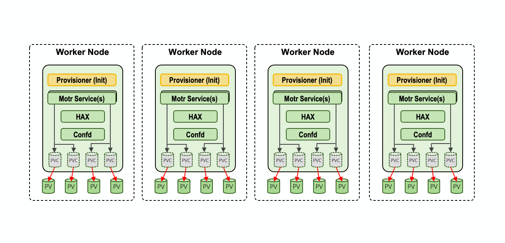
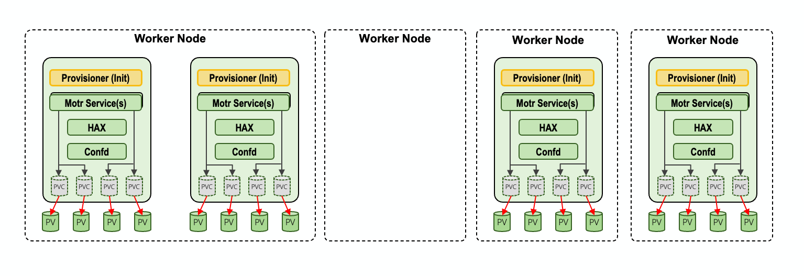

# Advanced Deployment Scenarios

This repository's root README file contains the most common user scenarios for deploying CORTX on Kubernetes. This page will document the more advanced deployment scenarios covering more complex use cases and capabilities of CORTX on Kubernetes. As much of these scenarios require manual configuration of otherwise-automated or templated artifacts, additional understanding and experience of both Kubernetes and CORTX is expected.

## Using manually-created PersistentVolumes

> ⚠️ **WARNING:** This use case assumes advanced knowledge of PersistentVolumes, StorageClasses, PersistentVolumeClaims, and how they all interact in Kubernetes workloads. Reference https://kubernetes.io/docs/concepts/storage/persistent-volumes/ for specifics.

### Using manually-created PersistentVolumes to map heterogeneous local paths

One of the main pre-requisites of CORTX on Kubernetes is that all storage provided to CORTX from the underlying infrastructure must be homogeneous -- that is to say, the same across all Kubernetes worker nodes. However, sometimes that is not possible. This use case will document how you can provide manually created PersistentVolumes to CORTX on Kubernetes in order to achieve finer-grained control over your storage layout.

As a warning, this does come at the cost of advanced and manually-required management of the underlying PersistentVolumes which will no longer be managed by `deploy-cortx-cloud.sh` and `destroy-cortx-cloud.sh`.

#### 1. Create a StorageClass _(if you do not already have one available for use)_

An example storage class for use by CORTX when manually creating PersistentVolumes, with the following points of configuration:
- You can select whatever unique value you would like for a StorageClass name
- It is imperative that you set `volumeBindingMode` to `WaitForFirstConsumer` in order to allow Kubernetes to schedule and attach Pods correctly to the underlying physical volumes.
- The value of the `provisioner` field will vary depending upon your Kubernetes cluster setup, but the majority of the time it can be left at `kubernetes.io/no-provisioner` unless you have explicitly installed a controller to manage and provision local path PersistentVolumes.

**Example StorageClass definition**:
```yaml
apiVersion: storage.k8s.io/v1
kind: StorageClass
metadata:
  name: manual-block-storage
provisioner: kubernetes.io/no-provisioner
volumeBindingMode: WaitForFirstConsumer
reclaimPolicy: Delete
```

#### 2. Create all your PersistentVolumes for use by CORTX

CORTX maps the dynamic PersistentVolumeClaims of the CORTX Data Pods to underlying PersistentVolumes based upon the `cortx.io/device-path` label. This label's value does not need to match the underlying `.spec.local.path` that the PersistentVolume actually points to. As such, you can manually map your own heterogeneous PersistentVolume paths into CORTX's requirement for homogeneous CVG device paths by applying the desired labels to each distinct PersistentVolume. As captured in the diagram below, the crux of this use case if the focus on the manual facilitiation of the **red arrows** inside of Kubernetes _(instead of CORTX explicitly creating those linkages by default)_.

|  |
|:--:|
| **Figure 1 - Advanced Use Cases - Manual PersistentVolume Mapping for CORTX Data Pods** |

CORTX Data Pods will create PVCs based upon the `cortx.io/device-path` label and automatically do the mapping conversion between `cortx.io/device-path` to `.spec.local.path`. In other words, the CORTX Data Pods will write to the `cortx.io/device-path` inside the running container and the underlying Kubernetes worker nodes will have that data storead at `.spec.local.path`.


Keep in mind that you will need to manage your own ReclaimPolicy when manually managing PersistentVolumes in this way. This will be most important after you remove a CORTX Cluster and before you deploy a new CORTX Cluster in its place on the same Kubernetes cluster.

**Example solution.yaml excerpt for CVG definitions**:
```yaml
storage_sets:
- name: storage-set-1
  durability:
    sns: 1+0+0
    dix: 1+0+0
  container_group_size: 1
  nodes:
  - {node-names}
  storage:
  - name: cvg-01
    type: ios
    devices:
      metadata:
      - path: /dev/sdc
        size: 25Gi
      data:
      - path: /dev/sdd
        size: 25Gi
  - name: cvg-02
    type: ios
    devices:
      metadata:
      - path: /dev/sde
        size: 25Gi
      data:
      - path: /dev/sdf
        size: 25Gi
```

**Manual PersistentVolume template**:
```yaml
apiVersion: v1
kind: PersistentVolume
metadata:
  name: manual-pv-{unique-id} 1️⃣
  labels:
    cortx.io/device-path: "dev-sdc" 2️⃣
spec:
  capacity:
    storage: 25Gi
  accessModes:
    - ReadWriteOnce
  volumeMode: Block
  storageClassName: manual-block-storage
  persistentVolumeReclaimPolicy: Retain
  local:
    path: /dev/mapper/xyz1 3️⃣
  nodeAffinity:
    required:
      nodeSelectorTerms:
      - matchExpressions:
        - key: kubernetes.io/hostname
          operator: In
          values:
          - {node-name} 4️⃣
```

The only requirements in the above PersistentVolume template are:
- 1️⃣: Each PersistentVolume still requires a unique name to be defined. This is not required to map to anything referencing either the `cortx.io/device-path` or `.spec.local.path` values, but depending upon your environment it may be helpful.
- 2️⃣: A Kubernetes label on each PV with the key `cortx.io/device-path` and the value of the hostPath device path (with path-separating slashes replaced with hyphens, e.g."dev-sdc")
- 3️⃣: The underlying path which will be used by the PersistentVolume on the Kubernetes worker node. This value does not have to match the value of the `cortx.io/device-path` label reference.
- 4️⃣: A NodeAffinity selector is required for each PV to map a given PV to a specific Node. _(Note that you can create multiple sets of PVs on the same worker node, as long as you map the `cortx.io/device-path` and `.spec.local.path` values to unique values. This is detailed in the next use case below)_

As an example, I have created 16 PersistentVolumes with labels mapped to the CVG device paths above, while having the underlying disk paths be customized:
```bash
> kubectl get pv -o custom-columns=NAME:.metadata.name,LABELS:.metadata.labels,PATH:.spec.local.path
NAME                 LABELS                              PATH
manual-pv-0703-sdc   map[cortx.io/device-path:dev-sdc]   /dev/cortx/disk0703p1
manual-pv-0703-sdd   map[cortx.io/device-path:dev-sdd]   /dev/cortx/disk0703p2
manual-pv-0703-sde   map[cortx.io/device-path:dev-sde]   /dev/cortx/disk0703p3
manual-pv-0703-sdf   map[cortx.io/device-path:dev-sdf]   /dev/cortx/disk0703p4
manual-pv-0704-sdc   map[cortx.io/device-path:dev-sdc]   /dev/cortx/disk0704p1
manual-pv-0704-sdd   map[cortx.io/device-path:dev-sdd]   /dev/cortx/disk0704p2
manual-pv-0704-sde   map[cortx.io/device-path:dev-sde]   /dev/cortx/disk0704p3
manual-pv-0704-sdf   map[cortx.io/device-path:dev-sdf]   /dev/cortx/disk0704p4
manual-pv-0705-sdc   map[cortx.io/device-path:dev-sdc]   /dev/cortx/disk0705p1
manual-pv-0705-sdd   map[cortx.io/device-path:dev-sdd]   /dev/cortx/disk0705p2
manual-pv-0705-sde   map[cortx.io/device-path:dev-sde]   /dev/cortx/disk0705p3
manual-pv-0705-sdf   map[cortx.io/device-path:dev-sdf]   /dev/cortx/disk0705p4
manual-pv-0706-sdc   map[cortx.io/device-path:dev-sdc]   /dev/cortx/disk0706p1
manual-pv-0706-sdd   map[cortx.io/device-path:dev-sdd]   /dev/cortx/disk0706p2
manual-pv-0706-sde   map[cortx.io/device-path:dev-sde]   /dev/cortx/disk0706p3
manual-pv-0706-sdf   map[cortx.io/device-path:dev-sdf]   /dev/cortx/disk0706p4
```

#### 3. Altering default install behavior to skip cortx-block-data deployment and use manually-created StorageClass

In order to direct the [`deploy-cortx-cloud.sh`](https://github.com/Seagate/cortx-k8s/blob/integration/k8_cortx_cloud/deploy-cortx-cloud.sh) script from automatically deploying its own local block data storage, you will need to provide the name of the StorageClass you created above to the deployment script prior to running it.

Set `CORTX_DEPLOY_CUSTOM_BLOCK_STORAGE_CLASS` equal to the value of your StorageClass name, defined above in Step 1.

```bash
export CORTX_DEPLOY_CUSTOM_BLOCK_STORAGE_CLASS=manual-block-storage
```

#### 4. Deploy CORTX on Kubernetes

Run [`deploy-cortx-cloud.sh`](https://github.com/Seagate/cortx-k8s/blob/integration/k8_cortx_cloud/deploy-cortx-cloud.sh) from the same shell environment in which the above two environment variables were set. You should see your manually created PersistentVolumes soon become bound to running CORTX Data Pods!

### Using manually-created PersistentVolumes to stack multiple Data Pods per Worker Node

CORTX manages each CORTX Data Pod, the finest-grained unit of storage management inside CORTX, through the use of a Kubernetes StatefulSet. By default, StatefulSets have anti-affinity built in to them so that Pods managed by the controller are spread out across the possible Kubernetes Worker Nodes on which they could run. This helps to enhance the reliability and durability of Kubernetes workloads by preventing a single Node failure from taking out multiple Pods from the same StatefulSet.

However, there are situations where it is beneficial to override this default anti-affinity behavior that is softly enforced by Kubernetes in order to achieve a higher level of deployment configurability, demonstration purposes, etc. This use case expands upon the previous use case above, by not only allowing manual mapping of PersistentVolumes on a given Kubernetes Worker Node, but also creating and labeling those PersistentVolumes in a way that multiple Pods from the same CORTX Data StatefulSet would get scheduled to the same Kubernetes Worker Node.

Note that we are again focusing on the **red arrows** and the manual facilitation of them in the diagram below, however there are now more PVs on one Kubernetes Worker Node and they are missing completely from another.

|  |
|:--:|
| **Figure 2 - Advanced Use Cases - Manual PersistentVolume Mapping for CORTX Data Pods on the same Worker Node** |

> Note, that this behavior is similarly capable with out-of-the-box CORTX configurations (as of v0.9.0), with the ability to configure the `container_group_size` parameter. When coupled with the complete listing of CVGs required in the solution configuration file, this allows you to dictate how many CORTX Data Pods would end up on a single Kubernetes Worker Node. The use case documented here allows you to create custom deployment topologies as needed, but is not expected to replace the default out-of-the-box behavior of CORTX in this regard.

#### 1. Create a StorageClass and manual PersistentVolumes

This use case will follow the majority of the steps in the above [Using manually-created PersistentVolumes to map heterogeneous local paths](#using-manually-created-persistentvolumes-to-map-heterogeneous-local-paths). Verify you are comfortable with Steps 1 and 2 in the above use case.

#### 2. Stack multiple Data Pods per Worker Node with manually-created PVs

The key to this use case is contained in the mapping of the PersistentVolumes to the generated PersistentVolumeClaims and that taking a higher priority than the implicit anti-affinity provided by the Kubernetes StatefulSet controllers. Using the same structure as defined above in Step 2, you can now create groups of PVs per Worker Node as long as you have enough PVs labeled with the appropriate `cortx.io/device-path` values.

For an environment with nodes named `0703`, `0704`, `0705`, and `0706`, the `kubectl` output at the end of the [Create all your PersistentVolumes for use by CORTX](#2-create-all-your-persistentvolumes-for-use-by-cortx), is complete. You can see that each node has 4 PVs each, labeled as `dev-sdc`, `dev-sdd`, `dev-sde`, and `dev-sdf`.

In order to see multiple Data Pods from the same StatefulSet controller be scheduled to the same Kubernetes Worker Node, you can update your labeling on some of these PVs. Assuming the Worker Nodes from above have enough underlying block devices to map to distinct PersistentVolumes, you could update the PVs as such to get 2 Data Pods scheduled to the `0703` Worker Node.

```bash
> kubectl get pv -o custom-columns=NAME:.metadata.name,LABELS:.metadata.labels,PATH:.spec.local.path
NAME                 LABELS                              PATH
manual-pv-0703-sdc0  map[cortx.io/device-path:dev-sdc]   /dev/cortx/disk0703p1
manual-pv-0703-sdd0  map[cortx.io/device-path:dev-sdd]   /dev/cortx/disk0703p2
manual-pv-0703-sde0  map[cortx.io/device-path:dev-sde]   /dev/cortx/disk0703p3
manual-pv-0703-sdf0  map[cortx.io/device-path:dev-sdf]   /dev/cortx/disk0703p4
manual-pv-0703-sdc1  map[cortx.io/device-path:dev-sdc]   /dev/cortx/disk0703p5
manual-pv-0703-sdd1  map[cortx.io/device-path:dev-sdd]   /dev/cortx/disk0703p6
manual-pv-0703-sde1  map[cortx.io/device-path:dev-sde]   /dev/cortx/disk0703p7
manual-pv-0703-sdf1  map[cortx.io/device-path:dev-sdf]   /dev/cortx/disk0703p8
manual-pv-0705-sdc   map[cortx.io/device-path:dev-sdc]   /dev/cortx/disk0705p1
manual-pv-0705-sdd   map[cortx.io/device-path:dev-sdd]   /dev/cortx/disk0705p2
manual-pv-0705-sde   map[cortx.io/device-path:dev-sde]   /dev/cortx/disk0705p3
manual-pv-0705-sdf   map[cortx.io/device-path:dev-sdf]   /dev/cortx/disk0705p4
manual-pv-0706-sdc   map[cortx.io/device-path:dev-sdc]   /dev/cortx/disk0706p1
manual-pv-0706-sdd   map[cortx.io/device-path:dev-sdd]   /dev/cortx/disk0706p2
manual-pv-0706-sde   map[cortx.io/device-path:dev-sde]   /dev/cortx/disk0706p3
manual-pv-0706-sdf   map[cortx.io/device-path:dev-sdf]   /dev/cortx/disk0706p4
```

You can see that the Kubernetes Worker Node named `0703` now has 8 PVs referenced to it _(by name via this console output; the PV's internal `nodeSelector` expression must be updated as well)_, where as the Worker Node named `0704` now has none.

If we were to deploy a CORTX Cluster using the same default values as the previous use case, we would now see 2 CORTX Data Pods scheduled to the `0703` Worker Node, 1 CORTX Data Pod each to the `0705` and `0706` Worker Nodes, while the `0704` Worker Node had 0 CORTX Data Pods scheduled to it _(as there are no longer any matching PVs that can satisfy the CORTX Data Pods storage requirements)_.

#### 3. Deploy CORTX on Kubernetes

Proceed with Steps 3 and 4 from the use case above, by altering the default behavior of `deploy-cortx-cloud.sh` through the use of environment variables and then deploying to Kubernetes!
