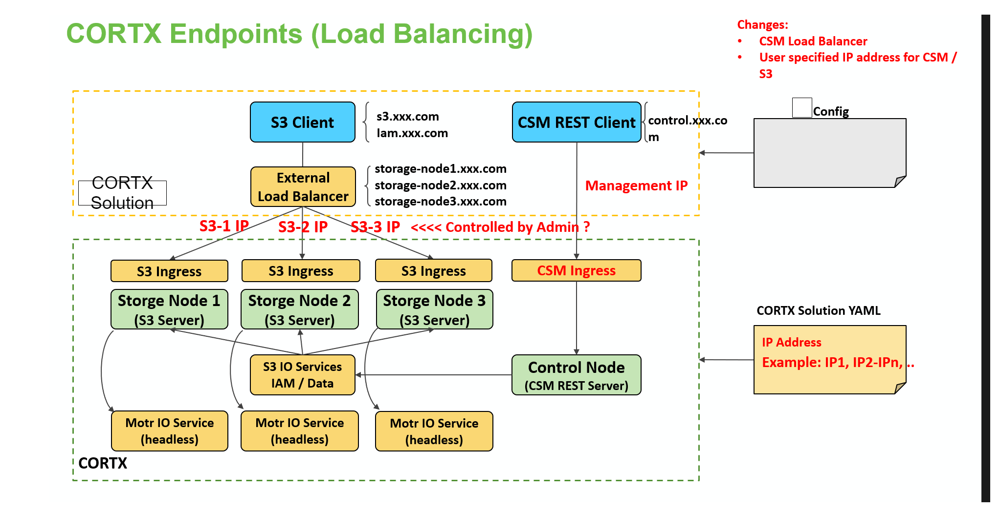

# CORTX Endpoints

## Deployment Architecture


<br><br>


## Accessing Management APIs

**Example Service**


<br><br>

As part of the services deployed  using V0.0.10, Management IPs can be accessed using following different ways


- Hostname of any Nodes which are part of CORTX Cluster **(Recommended)**
    - User should use port on which Service is configured. For example: 31169

- IPs of Nodes which are part of CORTX Cluster **(Recommended)**
    - User should use port on which Service is configured. For example: 31169

- External IP assigned to service **cortx-control-loadbal-svc**
    - This will require Kubernatese cluster like MettalLB installed
    - User should be using port on which CSM is running. For example 8081

- For Current version  V0.0.11 we can access csm using any hostname/ip of vm forming kubernetes cluster(master/worker) along with port 31169.


### **Open Query**

- In LAB or in LR too, VMs and HW will have two networks(data and management Network). How can we stop exposing CSM APIs to Data N/W

~~~~
[root@VM1 ~]# kubectl describe svc  cortx-control-loadbal-svc
Name:                     cortx-control-loadbal-svc
Namespace:                default
Labels:                   app.kubernetes.io/managed-by=Helm
Annotations:              meta.helm.sh/release-name: cortx-control
                          meta.helm.sh/release-namespace: default
Selector:                 app=cortx-control-pod
Type:                     LoadBalancer
IP:                       XX.XX.XX.XX
LoadBalancer Ingress:     XX.XX.XX.XX
Port:                     cotrx-control-8081  8081/TCP
TargetPort:               8081/TCP
NodePort:                 cotrx-control-8081  31169/TCP
Endpoints:                XX.XX.XX.XX:8081
Session Affinity:         None
External Traffic Policy:  Cluster
~~~~


## Accessing S3 APIs

**Example Services**

<br><br>

As part of the services deployed  using V0.0.10, Management IPs can be accessed using following different ways

- Hostname of any Nodes which are part of CORTX Cluster **(Recommended)**
    - User should use port on which Service is configured
    - For example: In the above image once can use following as S3 endpoints **(Recommended)**
        - http://<vmip1>:<mapped port>
        - http://<vmip2>:<mapped port>
        - http://<vmip3>:<mapped port>
        - http://<vmip4>:<mapped port>
- IPs of Nodes which are part of CORTX Cluster 
    - Similar to above example user need to get the pairs of IP Address and ports
- External IP assigned to service **cortx-control-loadbal-svc**
    - This will require Kubernatese cluster like MettalLB installed
    - User should be using port on which S3 is running
- For Current version V0.0.11 we can access loadbalancer services externally using any hostname/ip of vm forming kubernetes cluster(master/worker) along with port specified for that service. Ports specified in request will redirect request to specific service which is exposing that port. for above deployment:
    - http://vm1:30056 will always forward request to cortx-data-loadbal-svc-ssc-vm-rhev4-1363
    - http://vm2:31131 will always forward request to cortx-data-loadbal-svc-ssc-vm-rhev4-1364

### **Open Query**
- Will Ports per service gets changed if services/POD/Container gets restarted due to any reason?

```
[root@sVm1 ~]# kubectl describe svc cortx-data-loadbal-svc-ssc-vm-rhev4-1364
Name:                     cortx-data-loadbal-svc-ssc-vm-rhev4-1364
Namespace:                default
Labels:                   app.kubernetes.io/managed-by=Helm
Annotations:              meta.helm.sh/release-name: cortx-data-ssc-vm-rhev4-1364
                          meta.helm.sh/release-namespace: default
Selector:                 app=cortx-data-pod-ssc-vm-rhev4-1364
Type:                     LoadBalancer
IP:                       XX.XX.XX.XX
Port:                     cortx-s3-server001-tcp  80/TCP
TargetPort:               80/TCP
NodePort:                 cortx-s3-server001-tcp  31131/TCP
Endpoints:                XX.XX.XX.XX:80
Port:                     cortx-s3-server002-tcp  443/TCP
TargetPort:               443/TCP
NodePort:                 cortx-s3-server002-tcp  30775/TCP
Endpoints:                XX.XX.XX.XX:443
Port:                     cortx-s3-iam001-tcp  9080/TCP
TargetPort:               9080/TCP
NodePort:                 cortx-s3-iam001-tcp  32107/TCP
Endpoints:                XX.XX.XX.XX:9080
Port:                     cortx-s3-iam002-tcp  9443/TCP
TargetPort:               9443/TCP
NodePort:                 cortx-s3-iam002-tcp  31835/TCP
Endpoints:                XX.XX.XX.XX:9443
Session Affinity:         None
External Traffic Policy:  Cluster
Events:                   <none>

```


## Configuring External Load Balancer(HA Proxy)

Use following command from Control Plane of K8s (Primary node) to find out the Services:


```
kubectl get svc
//Sample outout:
[root@vm-rhev4-xxxx ~]# kubectl get svc
NAME                                            TYPE           CLUSTER-IP       EXTERNAL-IP   PORT(S)                                                                   AGE
consul-dns                                      ClusterIP      x.y.z.z     <none>        53/TCP,53/UDP                                                             24h
consul-server                                   ClusterIP      None             <none>        8500/TCP,8301/TCP,8301/UDP,8302/TCP,8302/UDP,8300/TCP,8600/TCP,8600/UDP   24h
cortx-control-clusterip-svc                     ClusterIP      x.x.x.x     <none>        8081/TCP                                                                  24h
cortx-control-headless-svc                      ClusterIP      None             <none>        <none>                                                                    24h
cortx-control-loadbal-svc                       LoadBalancer   x.x.x.x     <pending>     8081:31169/TCP                                                            24h
cortx-data-clusterip-svc-ssc-vm-g2-rhev4-2304   ClusterIP      x.x.x.x    <none>        80/TCP,443/TCP,9080/TCP,9443/TCP,28049/TCP,28051/TCP,28052/TCP,8500/TCP   24h
cortx-data-clusterip-svc-ssc-vm-g2-rhev4-2305   ClusterIP      x.x.x.x    <none>        80/TCP,443/TCP,9080/TCP,9443/TCP,28049/TCP,28051/TCP,28052/TCP,8500/TCP   24h
cortx-data-clusterip-svc-ssc-vm-g2-rhev4-2306   ClusterIP      x.x.x.x    <none>        80/TCP,443/TCP,9080/TCP,9443/TCP,28049/TCP,28051/TCP,28052/TCP,8500/TCP   24h
cortx-data-headless-svc-ssc-vm-g2-rhev4-2304    ClusterIP      None             <none>        <none>                                                                    24h
cortx-data-headless-svc-ssc-vm-g2-rhev4-2305    ClusterIP      None             <none>        <none>                                                                    24h
cortx-data-headless-svc-ssc-vm-g2-rhev4-2306    ClusterIP      None             <none>        <none>                                                                    24h
cortx-data-loadbal-svc-ssc-vm-g2-rhev4-2304     LoadBalancer   x.x.x.x    <pending>     80:31866/TCP,443:30349/TCP,9080:31455/TCP,9443:30000/TCP                  24h
cortx-data-loadbal-svc-ssc-vm-g2-rhev4-2305     LoadBalancer   x.x.x.x     <pending>     80:30528/TCP,443:31849/TCP,9080:31847/TCP,9443:31390/TCP                  24h
cortx-data-loadbal-svc-ssc-vm-g2-rhev4-2306     LoadBalancer   10.96.253.93     <pending>     80:31214/TCP,443:30614/TCP,9080:30212/TCP,9443:31814/TCP                  24h
cortx-gluster-svc-ssc-vm-g2-rhev4-2304          ClusterIP      10.108.185.155   <none>        1/TCP                                                                     24h
cortx-io-svc                                    ClusterIP      10.110.196.249   <none>        80/TCP,443/TCP,9080/TCP,9443/TCP,28049/TCP                                24h
kafka                                           ClusterIP      10.107.183.213   <none>        9092/TCP                                                                  24h
kafka-headless                                  ClusterIP      None             <none>        9092/TCP,9093/TCP                                                         24h
kubernetes                                      ClusterIP      10.96.0.1        <none>        443/TCP                                                                   26h
openldap-svc                                    ClusterIP      10.110.72.115    <none>        389/TCP                                                                   24h
zookeeper                                       ClusterIP      10.100.107.27    <none>        2181/TCP,2888/TCP,3888/TCP                                                24h
zookeeper-headless                              ClusterIP      None             <none>        2181/TCP,2888/TCP,3888/TCP                                                24h

```

> 📑 **In the config below sample is shown with values, you will need to update as per port numbers from your command output Example ports from above command:** <br>
`80:31866`, `80:30528`, `80:31214` <br>
`443:30349`, `443:31849`, `443:30614`


> 📑 **Also note** that the config below shows the sample when the cluster is **NOT running MetalLB Steps**

A sample configuration for above setup with HA Proxy (`haproxy.cfg`)

```
global
        log 127.0.0.1   local0
        log 127.0.0.1   local1 debug
        maxconn   45000 # Total Max Connections.
        daemon
        nbproc      1 # Number of processing cores.
		nbthread 4
defaults
        timeout server 86400000
        timeout connect 86400000
        timeout client 86400000
        timeout queue   1000s

#---------------------------------------------------------------------
# FrontEnd Configuration Setup 1
#---------------------------------------------------------------------
frontend main
    bind XX.XX.XX.XX:80 # This is the first network interface on which the first setup will be served
    
	option forwardfor
    default_backend cortx-setup-1
    bind XX.XX.XX.XX:443 ssl crt /etc/ssl/stx/stx.pem
	option forwardfor
    default_backend cortx-setup-https

    #s3 auth server port - iam
    bind XX.XX.XX.XX:9080
    acl s3authbackendacl dst_port 9080
    use_backend s3-auth if s3authbackendacl
    bind XX.XX.XX.XX:9443 ssl crt /etc/ssl/stx/stx.pem
    
	acl s3authbackendacl dst_port 9443
    use_backend s3-auth-https if s3authbackendacl
#---------------------------------------------------------------------
# BackEnd roundrobin as balance algorithm Setup 1
#---------------------------------------------------------------------
backend cortx-setup-1
    balance static-rr                                     #Balance algorithm
    server ha-s3-1 vm1IP:30209 # Public Data IP on Node1 and 30000+ port from svc command mapped to port 80
    server ha-s3-2 vm1IP:32308 # Public Data IP on Node2 and 30000+ port from svc command mapped to port 80
    server ha-s3-3 vm1IP:30429  # Public Data IP on Node3 and 30000+ port from svc command mapped to port 80
        
backend cortx-setup-https
    balance static-rr
    server ha-s3-ssl-1 vm1IP:30137 ssl verify none # Public Data IP on Node1 and 30000+ port from svc command mapped to port 443
    server ha-s3-ssl-2 vm1IP:31255 ssl verify none # Public Data IP on Node2 and 30000+ port from svc command mapped to port 443
    server ha-s3-ssl-3 vm1IP:31811 ssl verify none # Public Data IP on Node3 and 30000+ port from svc command mapped to port 443

#----------------------------------------------------------------------
# BackEnd roundrobin as balance algorith for s3 auth server
#----------------------------------------------------------------------
backend s3-auth
    balance static-rr   #Balance algorithm
    default-server inter 2s fastinter 100 rise 1 fall 5 on-error fastinter
    server s3authserver-instance1 vm1IP:30659 # Internal port mapped to 9080
    server s3authserver-instance2 vm1IP:30836 # Internal port mapped to 9080
    server s3authserver-instance3 vm1IP:30910 # Internal port mapped to 9080

backend s3-auth-https
    balance static-rr    #Balance algorithm
    default-server inter 2s fastinter 100 rise 1 fall 5 on-error fastinter
    server s3authserver-instance-ssl-1 vm1IP:32352 ssl verify none # Internal port mapped to 9443
    server s3authserver-instance-ssl-2 vm1IP:30555 ssl verify none # Internal port mapped to 9443
    server s3authserver-instance-ssl-3 vm1IP:31568 ssl verify none # Internal port mapped to 9443
```


