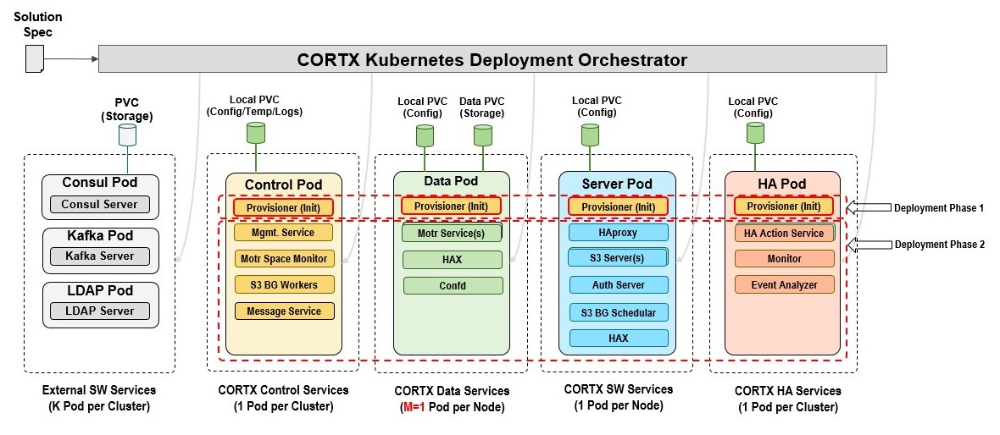

# CORTX on Kubernetes

[CORTX Community Object Storage](http://cortx.io/) is 100% open-source object storage, uniquely optimized for mass capacity storage devices. This repository provides capability and support for deploying CORTX onto the [Kubernetes](https://kubernetes.io/) container orchestration platform.

## Table of Contents:

1. [Project Overview](#project-overview)
1. [Reference Architecture](#reference-architecture)
1. [CORTX on Kubernetes Pre-requisites](#cortx-on-kubernetes-pre-requisites)
1. [Kubernetes Reference Deployments](#kubernetes-reference-deployments)
1. [Quick Start](#quick-start)
1. [Solution YAML Overview](#solution-yaml-overview)
1. [License](#license)

## Project Overview

This repository provides application-specific [Helm](https://helm.sh) charts and deployment scripts for deploying CORTX on to an existing [Kubernetes](https://kubernetes.io) cluster.

Deploying and managing Kubernetes is outside the scope of this repository, however configuration and best practices are offered as guidance where appropriate, along with links to [reference Kubernetes cluster deployment processes](#kubernetes-reference-deployments).

## Reference Architecture

TBD Context
## CORTX on Kubernetes Pre-requisites

TBD

1. [Helm](https://helm.sh/)

   CORTX on Kubernetes is provided via Helm Charts. As such, you will need Helm installed locally to deploy CORTX on Kubernetes. You can find the specific installation instructions for your local platform via the [Installing Helm](https://helm.sh/docs/intro/install/) section of the official Helm documentation.

2. [TBD](#tbd)

   TBD
## Kubernetes Reference Deployments

TBD

## Quick Start

TBD

## Solution YAML Overview

The CORTX solution consists of all paramaters required to deploy CORTX on Kubernetes. The pre-req, deploy, and destroy scripts parse the solution file and extract information they need to deploy and destroy CORTX.

All paths below are prefixed with `solution.` for fully-qualified naming.
### Global parameters

| Name                     | Description                                                                             | Value           |
| ------------------------ | --------------------------------------------------------------------------------------- | --------------- |
| `namespace`              | The kubernetes namespace for CORTX Pods to be deployed in.                              | `default`            |

### Secret parameters

This section contains the CORTX and third-party authentication information used to deploy CORTX on Kubernetes.

| Name                     | Description                                                                             | Value           |
| ------------------------ | --------------------------------------------------------------------------------------- | --------------- |
| `secrets.name`           | Name for the Kubernetes secret CORTX uses to store solution-specific secrets.           | `cortx-secret`            |
| `secrets.content.openldap_admin_secret`          | Administrator password for the OpenLDAP required service        | `seagate1` |
| `secrets.content.kafka_admin_secret`          | Administrator password for the Kafka required service        | `Seagate@123` |
| `secrets.content.consul_admin_secret`          | Administrator password for the Consul required service        | `Seagate@123` |
| `secrets.content.common_admin_secret`          | Administrator password for the CORTX common services        | `Seagate@123` |
| `secrets.content.s3_auth_admin_secret`          | Administrator password for the S3 Auth CORTX component        | `ldapadmin` |
| `secrets.content.csm_auth_admin_secret`          | Administrator password for the CSM Auth CORTX component        | `seagate2` |
| `secrets.content.csm_mgmt_admin_secret`          | Administrator password for the CSM Managment CORTX component   | `Cortxadmin@123` |

### Image parameters

This section contains the CORTX and third-party images used to deploy CORTX on Kubernetes.

| Name                     | Description                                                                             | Value           |
| ------------------------ | --------------------------------------------------------------------------------------- | --------------- |
| `images.cortxcontrolprov`          | Image name (registry, repository, & tag) for the CORTX Control Provisioner components   | `ghcr.io/seagate/cortx-all:2.0.0-stable-custom-ci` |
| `images.cortxcontrol`              | Image name (registry, repository, & tag) for the CORTX Control components   | `ghcr.io/seagate/cortx-all:2.0.0-stable-custom-ci` |
| `images.cortxdataprov`             | Image name (registry, repository, & tag) for the CORTX Data Provisioner components   | `ghcr.io/seagate/cortx-all:2.0.0-stable-custom-ci` |
| `images.cortxdata`                 | Image name (registry, repository, & tag) for the CORTX Data components   | `ghcr.io/seagate/cortx-all:2.0.0-stable-custom-ci` |
| `images.cortxserverprov`           | Image name (registry, repository, & tag) for the CORTX Server Provisioner components   | `ghcr.io/seagate/cortx-all:2.0.0-stable-custom-ci` |
| `images.cortxserver`               | Image name (registry, repository, & tag) for the CORTX Server components   | `ghcr.io/seagate/cortx-all:2.0.0-stable-custom-ci` |
| `images.cortxha`          | Image name (registry, repository, & tag) for the CORTX HA components   | `ghcr.io/seagate/cortx-all:2.0.0-stable-custom-ci` |
| `images.cortxclient`          | Image name (registry, repository, & tag) for the CORTX Client components   | `ghcr.io/seagate/cortx-all:2.0.0-stable-custom-ci` |
| `images.openldap`          | Image name (registry, repository, & tag) for the OpenLDAP required service   | `ghcr.io/seagate/symas-openldap:2.4.58` |
| `images.consul`          | Image name (registry, repository, & tag) for the Consul required service   | `ghcr.io/seagate/consul:1.10.0` |
| `images.kafka`          | Image name (registry, repository, & tag) for the Kafka required service   | `ghcr.io/seagate/kafka:3.0.0-debian-10-r7` |
| `images.zookeeper`          | Image name (registry, repository, & tag) for the Zookeeper required service   | `ghcr.io/seagate/zookeeper:3.7.0-debian-10-r182` |
| `images.rancher`          | Image name (registry, repository, & tag) for the Rancher Local Path Provisioner container   | `ghcr.io/seagate/local-path-provisioner:v0.0.20` |
| `images.busybox`          | Image name (registry, repository, & tag) for the utility busybox container   | `ghcr.io/seagate/busybox:latest` |

### Common parameters

This section contains common paramaters that applies to all CORTX Data nodes.

| Name                     | Description                                                                             | Value           |
| ------------------------ | --------------------------------------------------------------------------------------- | --------------- |
| `TBD`       | Hostname for the first node in the Kubernetes cluster available to deploy CORTX components. | `node-1` |

TBD

### Storage parameters

The metadata and data drives are defined in this section. All drives must be the same across all nodes on which CORTX Data will be deployed. A minimum of 1 CVG of type `ios` with one metadata drive and one data drive is required.

| Name                     | Description                                                                             | Value           |
| ------------------------ | --------------------------------------------------------------------------------------- | --------------- |
| `TBD`       | Hostname for the first node in the Kubernetes cluster available to deploy CORTX components. | `node-1` |

TBD

### Node parameters

This section contains information about all the worker nodes used to deploy CORTX cloud cluster. All nodes must have all the metadata and data drives mentioned in the "Storage" section above.

| Name                     | Description                                                                             | Value           |
| ------------------------ | --------------------------------------------------------------------------------------- | --------------- |
| `nodes.node1.name`       | Hostname for the first node in the Kubernetes cluster available to deploy CORTX components. | `node-1` |
| `nodes.node2.name`       | Hostname for the second node in the Kubernetes cluster available to deploy CORTX components. | `node-2` |
| `...`                    | ...                                                                                     | `...`
| `nodes.nodeN.name`       | Hostname for the Nth node in the Kubernetes cluster available to deploy CORTX components. | `""` |

    
## License

TBD 

---

###############################################
# Local block storage requirements            #
###############################################
1. Update the "solution.yaml" file to have correct worker node names in
   "solution.nodes.nodeX.name" (ensure this field match the 'NAME' field
   from the output of 'kubectl get nodes'), devices in the "storage.cvg*".
   This info is used to create persistent volumes and persistent volume
   claims for CORTX Provisioner and CORTX Data.

Note: "solution.common.storage_provisioner_path" is the mount point/directory used
by "Rancher Local Path Provisioner". The user must follow the
"Run prerequisite deployment script" section on each of the worker nodes in the
cluster

###############################################
# Run prerequisite deployment script          #
###############################################
1. Copy "prereq-deploy-cortx-cloud.sh" script, and the solution yaml file to all worker nodes:

scp prereq-deploy-cortx-cloud.sh <user>@<worker-node-IP-address>:<path-to-prereq-script>
scp <solution_yaml_file> <user>@<worker-node-IP-address>:<path-to-prereq-script>

Example:
scp prereq-deploy-cortx-cloud.sh root@192.168.1.1:/home/
scp solution.yaml root@192.168.1.1:/home/

2. Run prerequisite script on all worker nodes in the cluster, and untainted master node
   that allows scheduling. "<disk>" is a required input to run this script. This disk
   should NOT be any of the devices listed in "solution.storage.cvg*" in the "solution.yaml"
   file:

sudo ./prereq-deploy-cortx-cloud.sh <disk> [<solution-file>]

Example:
sudo ./prereq-deploy-cortx-cloud.sh /dev/sdb
or
sudo ./prereq-deploy-cortx-cloud.sh /dev/sdb solution_dummy.yaml

NOTE:
<solution-file> is an optional input to run "prereq-deploy-cortx-cloud.sh" script. Make sure to use
the same solution file for pre-req, deploy and destroy scripts (in the below section). The default
<solution-file> is "solution.yaml".

###############################################
# Deploy and destroy CORTX cloud              #
###############################################
1. Deploy CORTX cloud:
sudo ./deploy-cortx-cloud.sh [<solution-file>]

2. Destroy CORTX cloud:
sudo ./destroy-cortx-cloud.sh [<solution-file>] [--force|-f]

Example:
sudo ./destroy-cortx-cloud.sh solution.yaml --force

NOTE:
<solution-file> is an optional input to run deploy and destroy scripts. Make sure to use the same
solution file for both deploy and destroy scripts. The default <solution-file> is "solution.yaml"

Rancher Local Path location on worker node:
/mnt/fs-local-volume/local-path-provisioner/pvc-<UID>_default_cortx-fs-local-pvc-<node-name>

Rancher Local Path mount point in all Pod containers (CORTX Provisioners, Data, Control):
/data

###########################################################
# Replacing a dummy container with real CORTX container   #
###########################################################

@@@@@@@@@@@@@@@@@@@@@@@@@@@@@@@@@@@@@@@@@@@@@@@@@@@@@@@@@@@@@@@@@@@@@@@@@@@@@@@@@@@@@@@@@@@@@@@@@@@@@@@@@@@
The Helm charts work with both "dummy" and "CORTX ALL" containers. 
If image is ghcr.io/seagate/centos:7 helm runs in "dummy" mode any other name runs "CORTX ALL" mode

{- if eq $.Values.cortxdata.image  "ghcr.io/seagate/centos:7" }}  # DO NOT CHANGE
command: ["/bin/sleep", "3650d"]                                  # DO NOT CHANGE 
{{- else }}                                                       # DO NOT CHANGE
command: ["/bin/sleep", "3650d"]    #<<=========================== REPLACE THIS WITH THE CORTX ENTRY POINT 
{{- end }}                                                        # DO NOT CHANGE
@@@@@@@@@@@@@@@@@@@@@@@@@@@@@@@@@@@@@@@@@@@@@@@@@@@@@@@@@@@@@@@@@@@@@@@@@@@@@@@@@@@@@@@@@@@@@@@@@@@@@@@@@@@

See the following example from CORTX Data helm chart, replace the command section
hightlighted with "<<===" with the relevant CORTX container commands required for
the entrypoint. An "args" section also can be added to provide additional arguments.

./k8_cortx_cloud/cortx-cloud-helm-pkg/cortx-data/templates/cortx-data-pod.yaml

containers:
- name: cortx-s3-haproxy
   image: {{ .Values.cortxdata.image }}
   imagePullPolicy: IfNotPresent
   {- if eq $.Values.cortxdata.image  "ghcr.io/seagate/centos:7" }}  # DO NOT CHANGE
   command: ["/bin/sleep", "3650d"]                                  # DO NOT CHANGE 
   {{- else }}                                                       # DO NOT CHANGE
   command: ["/bin/sleep", "3650d"]    #<<=========================== REPLACE THIS WITH THE CORTX ENTRY POINT 
   {{- end }}                                                        # DO NOT CHANGE
   volumeDevices:
   {{- range .Files.Lines .Values.cortxdata.mountblkinfo }}
   - name: {{ printf "cortx-data-%s-pv-%s" ( base .) $nodename }}
      devicePath: {{ . }}
   {{- end }}
   volumeMounts:
   - name: {{ .Values.cortxdata.cfgmap.volmountname }}
      mountPath: {{ .Values.cortxdata.cfgmap.mountpath }}
   - name: {{ .Values.cortxdata.machineid.volmountname }}
      mountPath: {{ .Values.cortxdata.machineid.mountpath }}
   - name: local-path-pv
      mountPath: {{ .Values.cortxdata.localpathpvc.mountpath }}
   env:
   - name: UDS_CLOUD_CONTAINER_NAME
      value: {{ .Values.cortxdata.name }}
   ports:
   - containerPort: 80
   - containerPort: 443
   - containerPort: 9080
   - containerPort: 9443

The images can be changed by modifying the solution.yaml file section solution.images

solution:
  namespace: default
  images:
   cortxcontrolprov: ghcr.io/seagate/cortx-all:2.0.0-latest-custom-ci
   cortxcontrol: ghcr.io/seagate/cortx-all:2.0.0-latest-custom-ci
   cortxdataprov: ghcr.io/seagate/cortx-all:2.0.0-latest-custom-ci
   cortxdata: ghcr.io/seagate/cortx-all:2.0.0-latest-custom-ci
   openldap: ghcr.io/seagate/symas-openldap:standalone
   consul: hashicorp/consul:1.10.0
   kafka: bitnami/kafka:3.0.0-debian-10-r7
   zookeeper: bitnami/zookeeper:3.7.0-debian-10-r182
   rancher: rancher/local-path-provisioner:v0.0.20

NOTE: These images can be pre-downloaded on all worker nodes and untainted master node that
allows scheduling to avoid deployment failure due to docker pull rate limits.